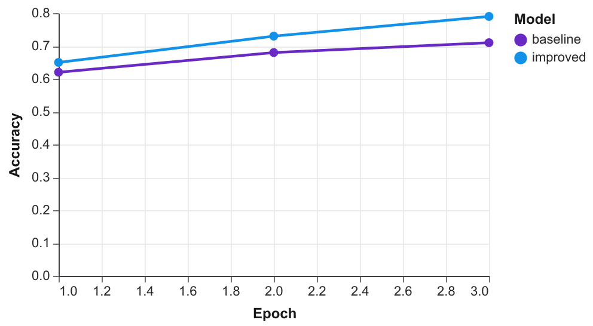
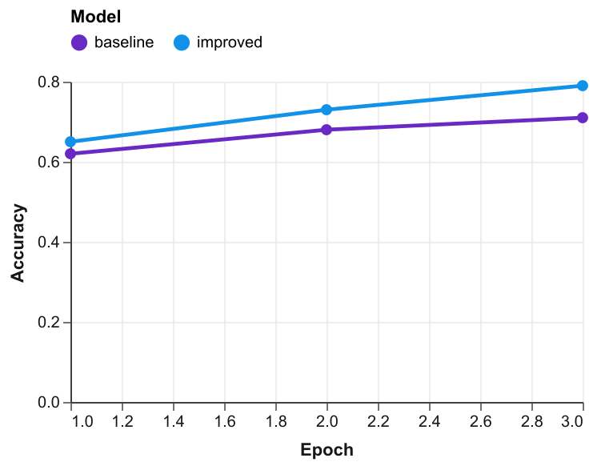
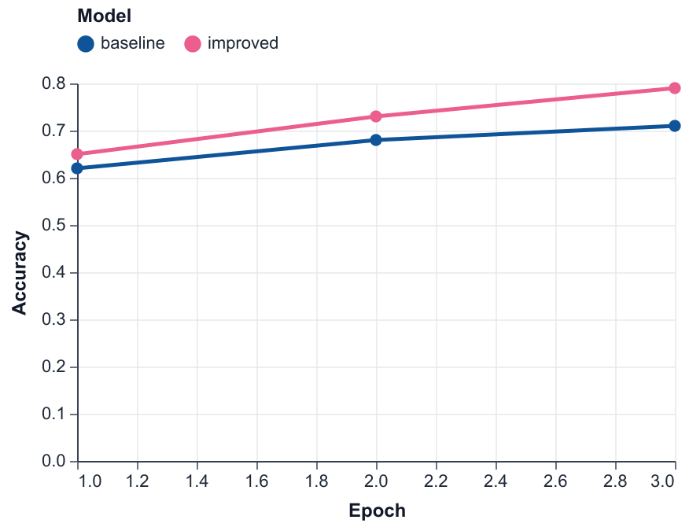
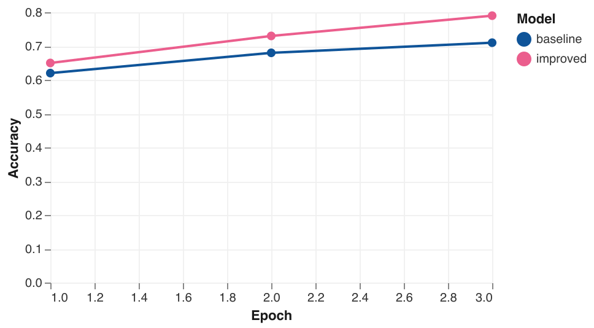
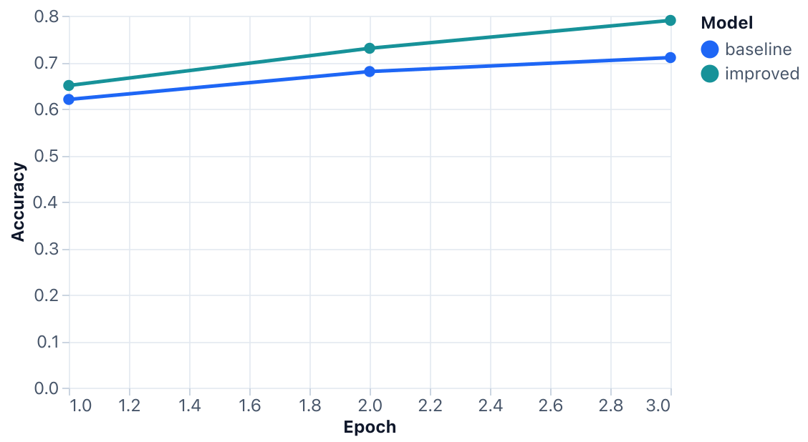
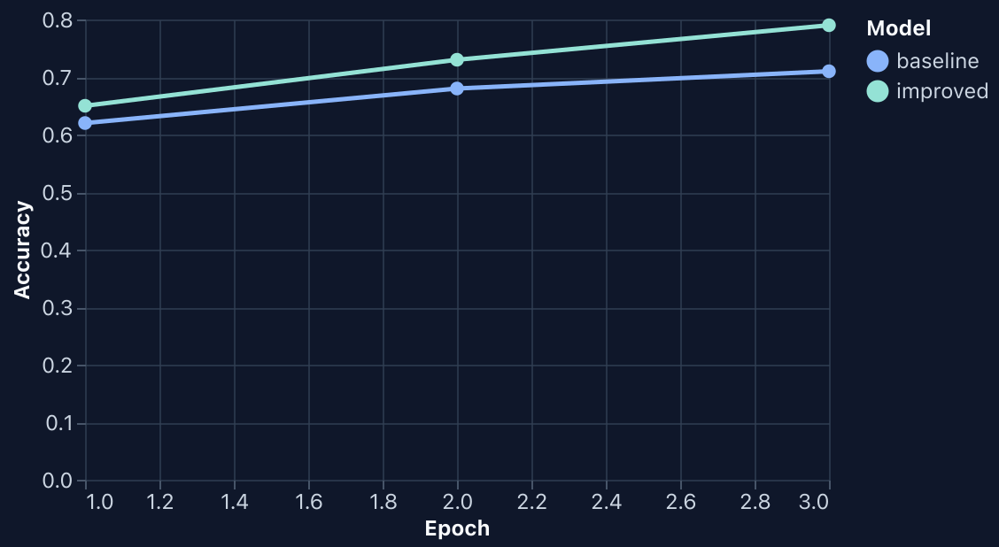
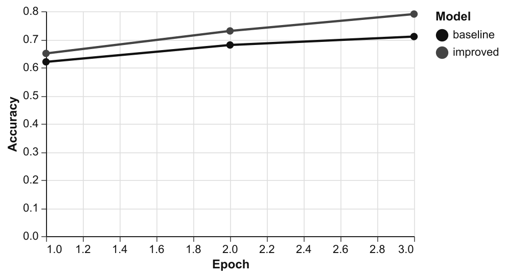
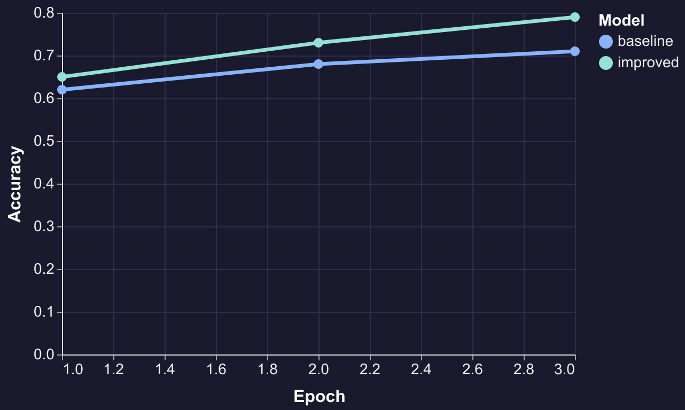

# VegaPaper

CLI for building publication-ready figures from CSV/JSON with [Vega-Lite](https://vega.github.io/vega-lite/). Generate specs with `infer`, apply paper themes, lint for common figure issues, and render to SVG, PNG, or PDF.

## Requirements

- [Bun](https://bun.sh) `1.3.14` (see [`.bun-version`](.bun-version))
- Node.js and Vega CLI binaries for rendering (`vl2svg`, `vl2png`, `vl2pdf`, … — checked by `doctor`)

## Install

Install `vega-paper` to `~/.local/bin` (includes Vega CLI shims for svg/png/pdf):

```bash
curl -fsSL https://raw.githubusercontent.com/nishide-dev/vega-paper/main/scripts/install.sh | bash
```

Open a new shell (or add `~/.local/bin` to your PATH), then verify:

```bash
vega-paper doctor
```

The installer downloads **GitHub Release** tarballs for your platform ([latest release](https://github.com/nishide-dev/vega-paper/releases/latest)).

Pin a version:

```bash
curl -fsSL https://raw.githubusercontent.com/nishide-dev/vega-paper/main/scripts/install.sh | bash -s -- --version 0.2.0
```

Develop from a clone or a locally built tarball:

```bash
bash scripts/install.sh --from-repo
bash scripts/build-release-tarball.sh --version 0.1.3 --target darwin-arm64
bash scripts/install.sh --from-tarball dist/release/vega-paper-0.1.3-darwin-arm64.tar.gz
```

## Development setup

```bash
bun install
bun run check
bun test
```

After install (`bash scripts/install.sh --from-repo` for contributors):

```bash
vega-paper --help
```

## Quick start

Render the hand-written line chart example:

```bash
bun run render:example
```

Generate a training curve from CSV, then render:

```bash
bun run infer:training-curve
bun run render:training-curve
```

More examples live under [`examples/`](examples/README.md).

## Figure previews

Same [basic-line](examples/basic-line/chart.vl.json) spec with every built-in theme (`--format png --scale 2`). Palette sources: [docs/palettes.md](docs/palettes.md).

| | | | |
|:---:|:---:|:---:|:---:|
|  |  |  |  |
| `paper-clean` | `acl-clean` | `neurips-clean` | `nature-soft` |
|  |  |  |  |
| `shadcn-light` | `shadcn-dark` | `monochrome-print` | `poster-dark` |

Regenerate: `bun run render:gallery`

## Commands

| Command | Purpose |
|---------|---------|
| `infer` | Build a Vega-Lite spec from CSV/JSON + chart options |
| `template` | Build layered ML figure specs (heatmap labels, Pareto frontier, scaling law, calibration, multipanel) |
| `render` | Render a spec to SVG, PNG, or PDF with an optional theme |
| `lint` | Check a spec against paper-oriented lint profiles (`--domain ml` for ML-paper rules) |
| `themes` | List built-in themes or `show` a built-in / custom JSON file |
| `doctor` | Verify render toolchain dependencies |

Example:

```bash
vega-paper infer data.csv \
  --chart line \
  --x epoch \
  --y f1 \
  --color model \
  --spec-out figures/f1.vl.json

vega-paper render figures/f1.vl.json \
  --theme paper-clean \
  --format svg \
  --out figures/f1.svg

vega-paper lint figures/f1.vl.json --profile paper
```

### `template` highlights

- **Templates:** `benchmark-heatmap`, `pareto-frontier`, `scaling-law`, `calibration-curve`, `violin`, `ecdf`, `multipanel`
- **Options:** template-specific field flags (`--x`, `--y`, `--score`, `--frontier`, `--fit`, `--bandwidth`, `--panel`, …) plus shared `--title`, `--width`, `--height`, `--spec-out`, `--out`, `--theme`
- **`multipanel`:** composes existing `.vl.json` files with `--panel <spec>:<label>[:<title>]` (repeatable); no CSV argument

```bash
vega-paper template scaling-law examples/scaling-law/data.csv \
  --x flops \
  --y loss \
  --x-scale log \
  --fit regression \
  --spec-out figures/scaling.vl.json
```

### `infer` highlights

- **Charts:** `line`, `bar`, `scatter`, `area`, `heatmap`, `boxplot`
- **Options:** `--x`, `--y`, `--color`, `--facet`, `--aggregate`, `--error-band`, type overrides, `--inline-data`
- **Output:** writes `.vl.json`; optionally renders with `--out` (`.svg`, `.png`, `.pdf`) and `--theme`

See [`examples/`](examples/) for copy-paste commands. Regenerate infer-based specs with `bun run infer:examples`; template-based specs with `bun run template:examples`.

### Output formats

Default for papers is **SVG** (canonical, diff-friendly). Use **PDF** for LaTeX submission and **PNG** for README or slides.

```bash
vega-paper render chart.vl.json --format pdf --out figure.pdf
vega-paper render chart.vl.json --out figure.png --scale 2
```

`infer --out` accepts `.svg`, `.png`, or `.pdf` with the same `--format` / `--scale` options.

### Custom themes

Pass a path to a theme JSON file instead of a built-in name:

```bash
vega-paper render chart.vl.json \
  --theme path/to/theme.json \
  --format svg \
  --out figure.svg
```

Format and example: [`examples/custom-theme/`](examples/custom-theme/) and [`docs/superpowers/specs/2026-06-04-vega-paper-custom-themes-design.md`](docs/superpowers/specs/2026-06-04-vega-paper-custom-themes-design.md).

## AI Skill

Agents can follow [`skills/vega-paper/SKILL.md`](skills/vega-paper/SKILL.md) for infer-first workflows, lint revision loops, and figure meta sidecars.

| Reference | Topic |
|-----------|-------|
| [chart-selection.md](skills/vega-paper/references/chart-selection.md) | Chart types, decision guide, modifiers |
| [theme-catalog.md](skills/vega-paper/references/theme-catalog.md) | Built-in themes and selection |
| [paper-style-guide.md](skills/vega-paper/references/paper-style-guide.md) | Lint profiles, sizes, LaTeX notes |
| [vega-lite-patterns.md](skills/vega-paper/references/vega-lite-patterns.md) | Hand-written specs and `render` |

All agent workflows use the installed `vega-paper` CLI — see `SKILL.md` for copy-paste commands.

## Development

| Script | Description |
|--------|-------------|
| `bun run check` | Biome lint/format check (CI) |
| `bun run check:fix` | Apply safe Biome fixes and formatting |
| `bun test` | Run tests |
| `bun run typecheck` | TypeScript check |
| `bun run build` | Build workspace packages |
| `bun run install:smoke` | Test install.sh + render from shims |
| `bun run infer:examples` | Regenerate committed example specs |
| `bun run template:examples` | Regenerate template-generated example specs |
| `bun run render:gallery` | Regenerate README gallery PNGs |

Note: `bun run check` is **code** quality (Biome). `vega-paper lint` is **figure spec** quality (Vega-Lite).

## Repository layout

```text
packages/cli/      vega-paper CLI
packages/themes/   eight built-in themes (paper, ACL, NeurIPS, shadcn, nature, poster, monochrome)
skills/            agent skills (vega-paper workflow)
examples/          sample data, reference specs, and READMEs
docs/              product roadmap and founding design (`roadmap.md`, `initial-design.md`)
docs/superpowers/  design specs and implementation plans
```

## License

See repository defaults. Current release: [v0.2.0](https://github.com/nishide-dev/vega-paper/releases/tag/v0.2.0).
