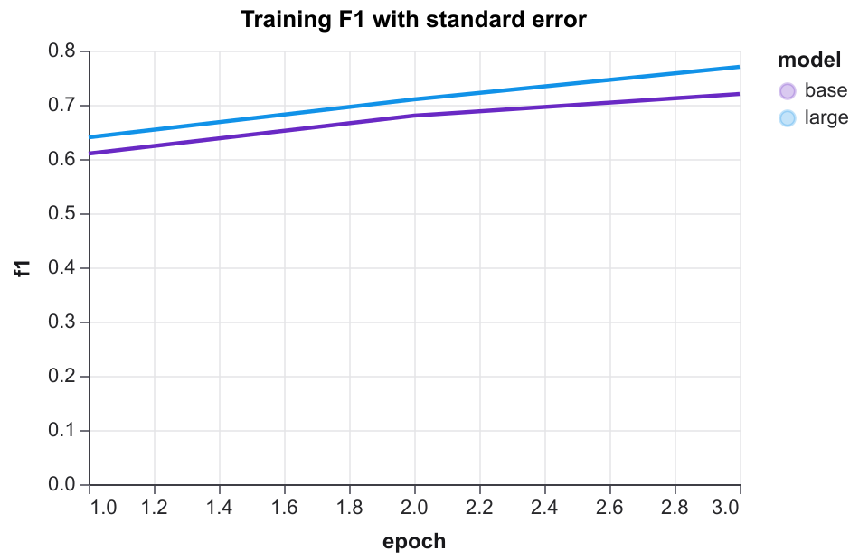
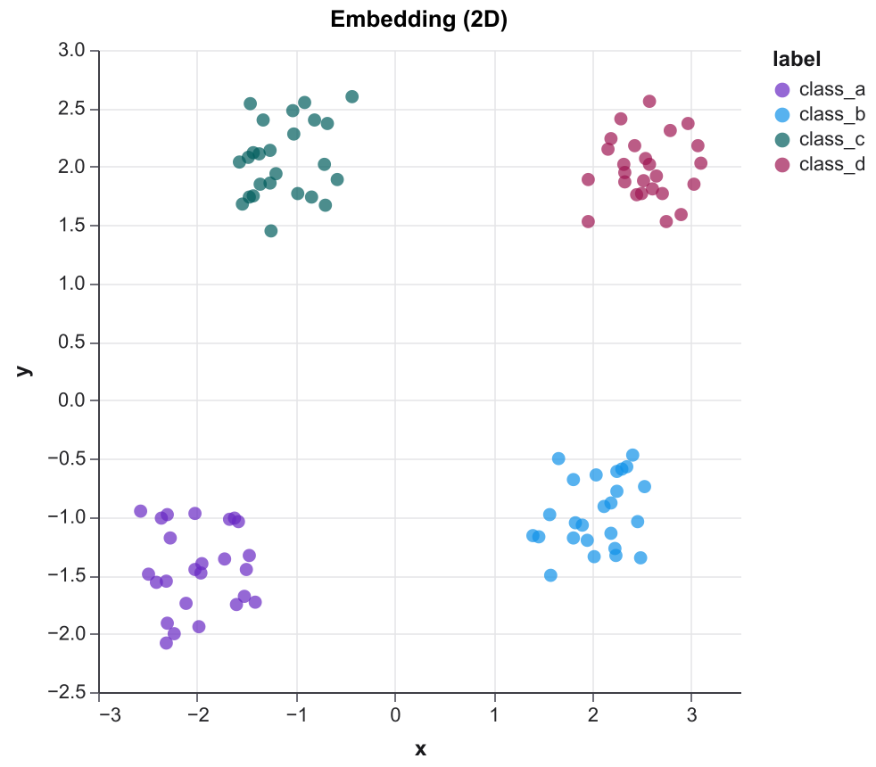
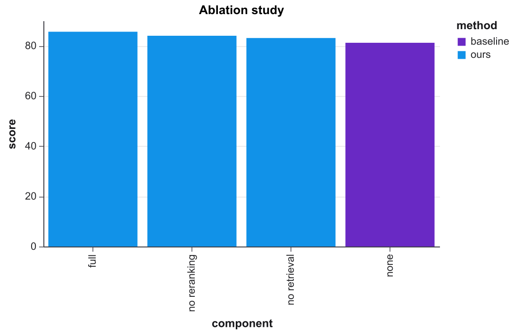
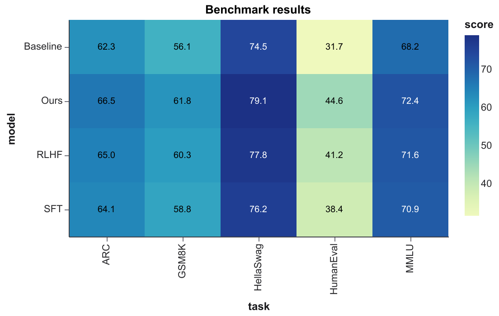
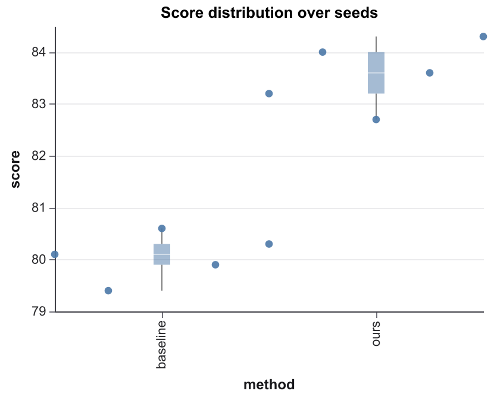
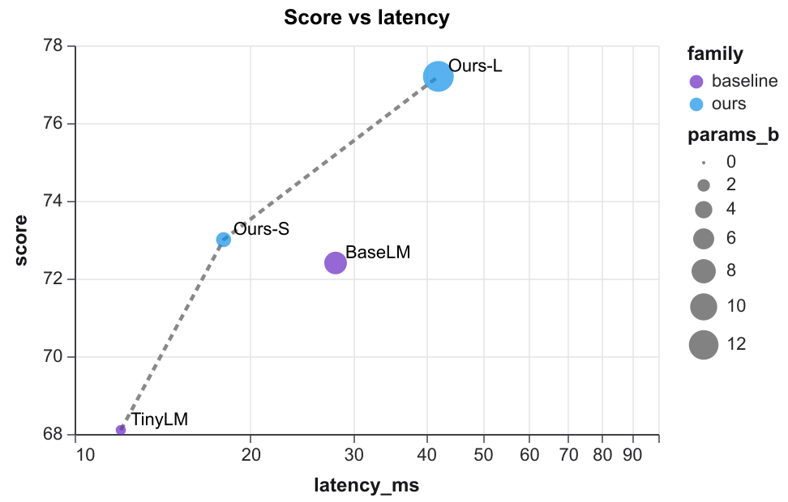
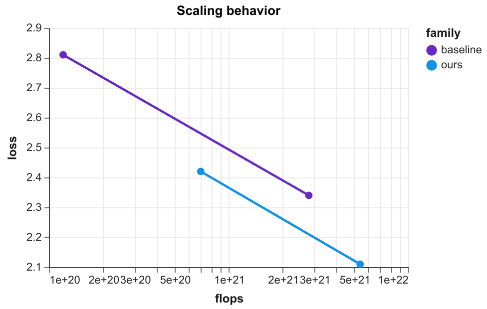
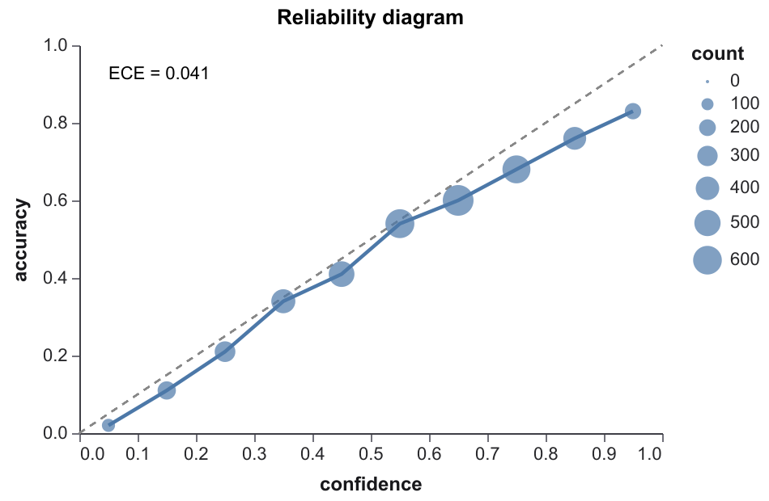
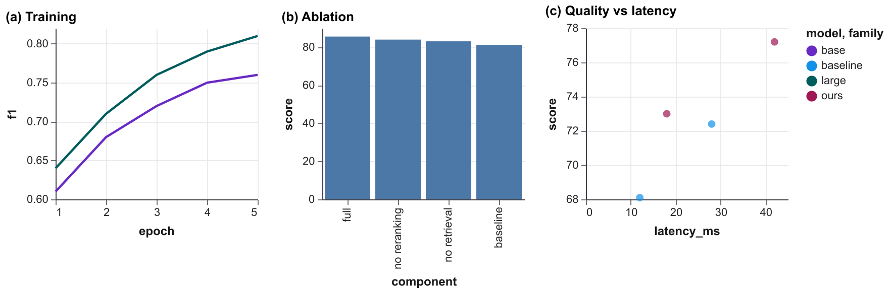

# VegaPaper examples

Small datasets and reference Vega-Lite specs for trying the CLI. Each folder has a README with exact commands.

| Folder | Demonstrates |
|--------|----------------|
| [basic-line/](basic-line/) | Hand-written spec; `render` and `lint` |
| [training-curve/](training-curve/) | `infer` line chart; `--aggregate mean`; `--error-band` shaded band |
| [confusion-matrix/](confusion-matrix/) | `infer` heatmap; sum aggregation from trial rows |
| [faceted-training/](faceted-training/) | `infer` with `--facet` small multiples |
| [boxplot/](boxplot/) | `infer` boxplot from raw sample rows; optional `--color` grouping |
| [embedding-scatter/](embedding-scatter/) | `infer` scatter; 2D embedding with `--color` |
| [multipanel-paper-figure/](multipanel-paper-figure/) | Hand-written `hconcat` spec with `(a)`/`(b)`/`(c)` panel labels; `template multipanel` composition |
| [ablation-bar/](ablation-bar/) | `infer` bar; ablation and grouped benchmark comparison |
| [benchmark-heatmap/](benchmark-heatmap/) | `infer` heatmap; hand-written labeled variant (rect + text) |
| [run-distribution/](run-distribution/) | `infer` boxplot over seeds; hand-written boxplot + raw points overlay |
| [pareto-frontier/](pareto-frontier/) | `template` Pareto frontier scatter with log-x and frontier overlay |
| [scaling-law/](scaling-law/) | `template` scaling law with log-x and optional regression fit |
| [calibration-curve/](calibration-curve/) | `template` reliability diagram with ECE annotation |
| [theme-samples/](theme-samples/) | Same spec rendered with every built-in theme |

## Gallery

Committed PNG previews (`paper-clean` unless noted). Theme comparison: [root README](../README.md#figure-previews).

| Example | Preview |
|---------|---------|
| [basic-line/](basic-line/) |  |
| [training-curve/](training-curve/) |  |
| [training-curve/](training-curve/) error band |  |
| [confusion-matrix/](confusion-matrix/) |  |
| [faceted-training/](faceted-training/) |  |
| [boxplot/](boxplot/) |  |
| [embedding-scatter/](embedding-scatter/) |  |
| [ablation-bar/](ablation-bar/) |  |
| [benchmark-heatmap/](benchmark-heatmap/) |  |
| [run-distribution/](run-distribution/) |  |
| [pareto-frontier/](pareto-frontier/) |  |
| [scaling-law/](scaling-law/) |  |
| [calibration-curve/](calibration-curve/) |  |
| [custom-theme/](custom-theme/) |  |
| [multipanel-paper-figure/](multipanel-paper-figure/) |  |

Regenerate: `bun run render:gallery`

## Quick start

```bash
# Render the hand-written line chart
bun run render:example

# Compare all built-in themes (writes SVGs under theme-samples/)
bun run render:theme-samples

# Generate and render a training curve from CSV
bun run infer:training-curve
bun run render:training-curve
```

## Regenerate reference specs

From the repo root:

```bash
bun run infer:examples
bun run template:examples
```

This overwrites committed `chart*.vl.json` files under `examples/`. See each folder README for individual commands.

SVG outputs (`output.svg`, `theme-samples/*.{svg,meta.json}`) are not committed. Add them locally with the `render:*` scripts or the render commands in each README.
